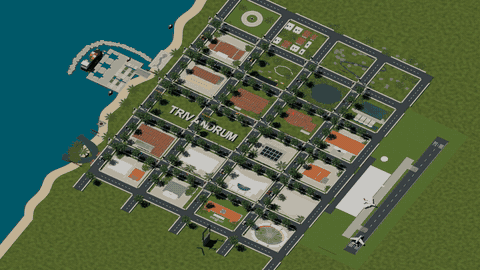

# Trivandrum — a city coming to life

An animated Blender miniature of Thiruvananthapuram, with rising landmarks, a red TRIVANDRUM rooftop reveal, moving trains, an aircraft taking off, and road traffic.

## Watch the video

Click the animated preview to open the full **1080p / 60 fps / 18-second** video with audio.

[Watch or download the full MP4](https://github.com/robinfrancis186/trivandrum-blender/raw/refs/heads/main/outputs/Trivandrum-Closer-1080p60.mp4)

The GIF is a smaller, silent preview; the linked MP4 contains the full frame rate and soundtrack.

## Model at a glance

An editable, procedurally assembled Blender city miniature with landmark architecture, coastal terrain, roads, vegetation, vehicles, railway infrastructure and animated typography. The camera gradually moves closer to reduce empty ground around the city.

| Component | Count |
|---|---:|
| **Total objects in the main scene** | **778** |
| Mesh objects / unique mesh datablocks | 572 / 572 |
| Empty objects used as parents and controls | 154 |
| Text objects | 49 |
| Lights | 2 |
| Camera | 1 |
| Numbered landmark and infrastructure collections | 25 |
| Construction animation groups | 26 |
| Assigned materials | 145 |
| Packed image textures | 2 |
| Packed soundtrack | 1 |
| Embedded text datablocks, including scripts and reports | 25 |

These figures come from direct inspection of the main scene in the delivered `.blend` file. **Objects are not the same as individual visible parts:** windows, rail sleepers, foliage and other repeated details are often combined into larger meshes. Collection counts include controls and other object types, and do not cover every supporting scene object.

### Geometry and animation data

| Metric | Value |
|---|---:|
| Stored mesh vertices | 695,653 |
| Stored mesh polygons | 406,944 |
| Objects with an assigned animation action | 114 |
| Object-level animation drivers | 240 |
| Rising title letters | 10 |
| Independently controlled title rooftops | 10 |

Geometry totals sum the stored mesh data per object, before modifiers and render-time evaluation. Polygons are **not** a triangle count. The action count excludes animation on material and camera datablocks; parented objects also inherit motion without needing their own action.

[View the complete machine-readable model inventory](docs/model-inventory.json).

## Landmark and infrastructure collections

The scene has 24 numbered landmark groups plus a railway group. Some collections contain multiple attractions, such as Napier Museum and Zoo or the Palayam mosque and temple.

| No. | Collection | Blender objects in collection |
|---|---|---:|
| 01 | Sree Padmanabhaswamy Temple | 7 |
| 02 | Kuthira Malika Palace | 7 |
| 03 | Napier Museum and Zoological Park | 22 |
| 04 | Kanakakunnu Palace | 8 |
| 05 | Technopark Trivandrum | 9 |
| 06 | Kovalam Beach | 9 |
| 07 | Shanghumukham Beach | 5 |
| 08 | Poovar Island | 7 |
| 09 | Neyyar Wildlife Sanctuary | 12 |
| 10 | Ponmudi Hill Station | 12 |
| 11 | K-DISC HQ India Heights | 10 |
| 12 | Palayam • Juma Masjid and Ganapathy Temple | 4 |
| 13 | Palayam • St Joseph Metropolitan Cathedral | 3 |
| 14 | Kerala Government Secretariat | 3 |
| 15 | Neyyar Dam • four spillway gates | 4 |
| 16 | Vizhinjam International Seaport | 5 |
| 17 | State Central Library | 4 |
| 18 | Thampanoor KSRTC Bus Terminal | 4 |
| 19 | Thiruvananthapuram International Airport | 8 |
| 20 | Greenfield International Stadium | 3 |
| 21 | LuLu Mall Thiruvananthapuram | 5 |
| 22 | Kerala Legislative Assembly • Niyamasabha | 4 |
| 23 | LMS • CSI Mateer Memorial Church | 3 |
| 24 | Trivandrum public statues | 5 |
| 25 | Railway • double track viaduct and station | 7 |

The public-statue group includes Ayyankali, Gandhi and Ambedkar. K-DISC is represented by India Heights. Additional scene objects provide neighborhoods, roads, coastline, vegetation, labels, the central title and traffic. Some supporting details are parented to a landmark's construction control while residing outside its collection, so the table is a collection inventory rather than a complete parts list for each building.

## Transport and street components

| Feature | Modeled quantity / behavior |
|---|---|
| Cars | 24 animated road users |
| Motorbikes | 16 animated road users |
| Bicycles | 16 animated road users |
| **Total road users** | **56** |
| Traffic signal heads | 80 |
| Passenger trains | 2 trains, six cars each; 12 train cars in total |
| Railway | Two separate elevated tracks, viaduct supports, rails, sleepers, overhead wires and station platforms |
| Aircraft | 2: one animated departure and one parked aircraft |
| Airport | Terminal, apron, control tower and runway |
| Seaport | Container ship, cargo containers, cranes and breakwater |

The train cars are modeled within combined train meshes, so twelve visible cars do not appear as twelve separate Blender objects. Road animation includes signal stops, rotating wheels and rider motion. Trains travel in opposite directions on separate tracks. The departing aircraft accelerates along the runway, lifts off and banks across the city.

## Animation sequence

| Stage | What happens |
|---|---|
| Opening | Landmark groups rise in staggered order; the railway grows horizontally. Trains become visible after the track reveal. |
| Title build | Ten letter-shaped towers rise sequentially to form TRIVANDRUM. |
| Around 7–8.8 seconds | A left-to-right rooftop sweep changes the title from pale gray to red. |
| Closing | The camera pushes closer to the completed city while traffic, trains and the aircraft continue moving. |

The 26 construction groups comprise the 25 numbered collections plus the neighborhood group. The title has its own animation. The camera uses four keyed orthographic scales: **120 → 117 → 108 → 100**, at frames **1, 300, 660 and 1080**.

## Render and presentation

| Setting | Delivered configuration |
|---|---|
| Blender version inspected | 5.2.1 LTS |
| Render engine | EEVEE |
| Resolution | 1920 × 1080, at 100% scale |
| Frame rate | 60 fps |
| Duration | 18 seconds |
| Timeline | Frames 1–1080 |
| Render samples | 32 |
| Motion blur | Enabled; shutter 0.35 |
| Color management | AgX, Medium High Contrast, exposure +0.25 |
| Camera | Orthographic, animated position/orientation and scale |
| Delivery | H.264 MP4 with AAC soundtrack |

The video is rendered natively at 1080p/60 fps, without image upscaling or frame interpolation. The README GIF is a reduced, silent preview of the full video.

## Open and edit the model

1. Download [the editable Blender project](outputs/Trivandrum-Closer-1080p60.blend).
2. Open it in **Blender 5.2.1 LTS**, the version used for this project. Compatibility with other versions has not been tested.
3. Select the main scene, `TRIVANDRUM • Photo reconstruction`, and use the timeline to inspect frames 1–1080.
4. Use the Outliner to select landmark collections, or select the camera to adjust the framing.
5. Open Blender's Text Editor to inspect the embedded construction scripts and reports. These retain authoring history and may contain original local paths; they are not a portable one-click rebuild package.

The project packs two image textures—`heritage-material-atlas.png` and `temple-elevation.png`—and its soundtrack. It can be opened and edited directly in Blender without an MCP connection. MCP was used during authoring to control Blender and inspect the scene.

## Repository contents

| File | Purpose |
|---|---|
| [Blender project](outputs/Trivandrum-Closer-1080p60.blend) | Editable geometry, materials, camera and animation |
| [Full video](outputs/Trivandrum-Closer-1080p60.mp4) | Finished closer-framing film with sound |
| [Animated preview](docs/preview.gif) | Lightweight README playback preview |
| [Model inventory](docs/model-inventory.json) | Scene object, geometry, material and animation counts |
| [Video verification](outputs/Trivandrum-Closer-1080-Video-Verification.json) | Final encode and full-decode results |
| [Camera verification](outputs/Trivandrum-Closer-Camera-Verification.json) | Camera and timeline checks |

## Verification and scope

The final MP4 was fully decoded: **1,080 frames, 1920 × 1080, 60 fps, 18 seconds**, with no decode errors. The four camera scale keys were checked in the saved Blender project. The inventory reports the main scene's stored objects and geometry; it is not a count of rendered pixels, evaluated triangles or individual architectural details.

This is a **stylized, condensed miniature** with approximate architecture, geography and statue likenesses. It is not a surveyed city map or an exact, hyperrealistic reconstruction. No personal employment dates appear in the film.

## Licensing

No repository-wide LICENSE file is included. This documentation does not grant a new software license. Existing third-party licenses and notices continue to apply to their respective code, datasets, artwork, and trademarks. Contact the maintainers to clarify permissions before redistributing project-owned material.
